# 物业租赁综合管理系统 — 使用说明书

> 版本：v1.0.3 | 适用于 Windows 10/11 x64 桌面版

---

## 目录

1. [1. 系统概述](#1-系统概述)
2. [2. 安装与启动](#2-安装与启动)
3. [3. 登录与权限](#3-登录与权限)
4. [4. 界面与导航](#4-界面与导航)
5. [5. 首页概览](#5-首页概览)
6. [6. 收租管理](#6-收租管理)
7. [7. 物业管理](#7-物业管理)
8. [8. 合同管理](#8-合同管理)
9. [9. 消防管理](#9-消防管理)
10. [10. 财务报表](#10-财务报表)
11. [11. 系统设置](#11-系统设置)
12. [12. 打印与导出](#12-打印与导出)
13. [13. 自动化与通知](#13-自动化与通知)
14. [14. 数据维护与备份](#14-数据维护与备份)
15. [15. 常见问题](#15-常见问题)

---

## 1. 系统概述

物业租赁综合管理系统是一款面向物业管理公司与产业园区运营方的一体化桌面应用，覆盖招租获客、房源房态、签约履约、收租催缴、物业服务、消防安全与财务核算的完整业务闭环。系统安装后即可离线运行，所有数据保存在本机，无需部署服务器。

### 1.1 功能地图

系统共 7 个一级菜单、86 个业务页面，按业务域划分如下。

| 一级菜单 | 覆盖能力 |
|------|------|
| 首页概览 | 全局 KPI、今日待办、收入趋势、多模块看板、系统信息 |
| 收租管理 | 房源、招租线索、入住交接、房态看板、租客档案、租客风控、租金定价、押金台账、退租管理、账单收租、收租日历、智能催缴、门锁管理、收租看板 |
| 物业管理 | 运营看板、租户服务、装修管理、维保计划、排班与质检、巡更、访客、特种设备、项目管理、经营简报、报修工单、设施设备、抄表计费、停车、投诉建议、住户档案、公告发布、公共收益、外包供应商、仓库物料 |
| 合同管理 | 合同台账、起草、审批、看板、到期、续约、模板、条款批量导入、合规检查 |
| 消防管理 | 消防看板、检查记录、器材台账、违规记录、演练记录 |
| 财务报表 | 账套、科目、凭证、费用、税务、预算、报表中心、财务看板、固定资产、银行对账、成本分摊、发票管理 |
| 系统设置 | 用户、审计日志、数据字典、打印设置、身份证读卡器、审批流程、权限矩阵、系统参数、系统运维 |

另有两个全局入口：**全局检索**（跨房源/租客/合同/账单/工单/投诉/住户/线索的统一搜索）与**审批中心**（待我审批 / 我发起的）。

### 1.2 运行特性

| 特性 | 说明 |
|------|------|
| 运行环境 | Windows 10 / 11 x64，无需安装数据库或运行时 |
| 数据库 | 内置 SQLite（零配置），可切换 MySQL |
| 数据位置 | 全部保存在本机用户目录，不上传云端 |
| 账号安全 | JWT 认证（登录态 4 小时）+ 12 角色 RBAC + 不可逆操作二次确认 |
| 实时性 | 内置 WebSocket，房态与合同变更即时推送到所有已打开的页面 |
| 自动化 | 内置 7 个定时任务（账单生成、催缴升级、合同到期、资产折旧等） |
| 导入导出 | Excel 采用 .xlsx 格式；PDF 由系统内置引擎直接生成文字版 |
| 升级方式 | NSIS 安装包覆盖安装，自动保留原有数据 |

---

## 2. 安装与启动

### 2.1 安装步骤

1. 双击运行安装包 `物业租赁综合管理系统-1.0.3-x64.exe`。
2. 若出现「Windows 已保护你的电脑 / 未知发布者」提示，点击「更多信息」→「仍要运行」。该提示由安装包未附加代码签名证书引起，不影响功能。
3. 选择安装目录（默认 `C:\Program Files\物业租赁综合管理系统`），点击「安装」。
4. 安装完成后桌面与开始菜单自动创建快捷方式。

覆盖升级时无需卸载旧版本：安装程序会读取注册表中的原安装路径就地升级，业务数据保存在用户目录下，不会被覆盖。

### 2.2 首次启动

首次启动时系统会依次完成：创建数据目录、建库建表、创建管理员账户、写入演示数据（房源、租客、合同、账单、门锁、消防器材、会计科目等）。

这一过程通常需要 10-30 秒，登录页会显示「正在初始化，请稍候」，初始化完成后登录按钮才可用。后续启动只需 3-5 秒。

### 2.3 数据存放位置

| 内容 | 路径 |
|------|------|
| 数据库文件 | `%APPDATA%\property-rental-system\data\database.sqlite` |
| 上传附件 | `%APPDATA%\property-rental-system\uploads\` |
| 运行日志 | `%APPDATA%\property-rental-system\logs\` |

在文件资源管理器地址栏输入 `%APPDATA%\property-rental-system` 可直接打开该目录。**卸载程序不会删除这个目录**，因此重装后数据仍在。

---

## 3. 登录与权限

### 3.1 默认账户

| 用户名 | 密码 | 角色 |
|--------|------|------|
| admin | admin123 | 管理员 |

首次登录后请立即在「系统设置 → 用户管理」中修改默认密码，并为每位实际使用者建立独立账号。系统禁止删除或降级最后一个管理员账号，避免出现无人可管理的情况。

登录态有效期为 4 小时，过期后会自动跳回登录页；应用在前台使用时会自动续期，无需手动重新登录。

### 3.2 角色与可访问模块

系统内置 12 个角色。菜单可见性与页面访问权由角色决定，后端接口另有一层独立校验，**前端隐藏菜单不等于接口放行，两层都会拦截**。

| 角色 | 可进入的一级菜单 |
|------|-----------|
| 管理员 | 全部（含系统设置） |
| 总经理 | 全部业务模块（只读 + 审批 + 导出），不含系统设置 |
| 收租主管 | 收租管理 |
| 收租员 | 收租管理 |
| 物业经理 | 物业管理 |
| 维修工 | 物业管理（工单与设施相关） |
| 财务主管 | 财务报表 |
| 会计 | 财务报表 |
| 出纳 | 财务报表 |
| 合同主管 | 合同管理 |
| 法务 | 合同管理 |
| 安全主管 | 消防管理 |

### 3.3 操作级权限

在模块可见的前提下，系统进一步按 6 种动作控制具体按钮：新增、查看、修改、删除、审批、导出。典型差异如下。

| 角色 | 权限要点 |
|------|------|
| 收租主管 | 收租模块全权限；合同只读 |
| 收租员 | 收租模块可新增/修改/导出，**不能删除** |
| 财务主管 | 财务全权限，含审批与导出 |
| 会计 | 财务可录入、修改、导出，**不能删除、不能审批** |
| 出纳 | 财务仅查看与修改（如登记收款），**不能新增、删除、审批** |
| 法务 | 合同只读 + 审批；合规模块可修改与导出 |
| 维修工 | 工单可新增/修改，设施与抄表仅可修改，**不能删除** |
| 安全主管 | 消防模块全权限；物业与投诉只读 |

管理员可在「系统设置 → 权限矩阵」中按角色逐模块调整上述权限，调整结果实时生效，无需重启。

### 3.4 不可逆操作的二次确认

删除发票、发票作废与红冲、资产删除与折旧、凭证作废、账套修改、费用审批、权限变更、删除字典、重置用户密码、下载数据备份等操作，会弹出对话框要求**操作者再次输入本人登录密码**。这是防止误操作和他人借用已登录电脑的最后一道防线，输入的是当前登录者自己的密码，而不是管理员密码。

---

## 4. 界面与导航

系统采用「左侧菜单 + 顶部工具栏 + 主内容区」的经典布局。

- **左侧菜单**：按角色自动过滤，无权限的模块不会出现。点击一级菜单展开二级页面。
- **顶部工具栏**：全局搜索框、消息通知铃铛（未读数量红点）、当前用户与角色标识、退出登录。
- **面包屑**：主内容区左上角显示「首页 / 当前模块 / 当前页面」，点击可回退。
- **列表页通用交互**：顶部为筛选条件，中部为数据表格，底部为分页。首次加载显示骨架屏，无数据时显示统一空状态并给出下一步引导按钮。
- **实时刷新**：房态变更、合同状态变更等事件由后台实时推送，相关页面自动更新，无需手动刷新。

### 4.1 全局检索

菜单最下方的「全局检索」提供一个搜索框，跨房源、租客、合同、账单、工单、投诉、住户、线索统一检索，结果按类型分组展示，点击直接跳转到对应记录。顶部工具栏的搜索框是同一入口。

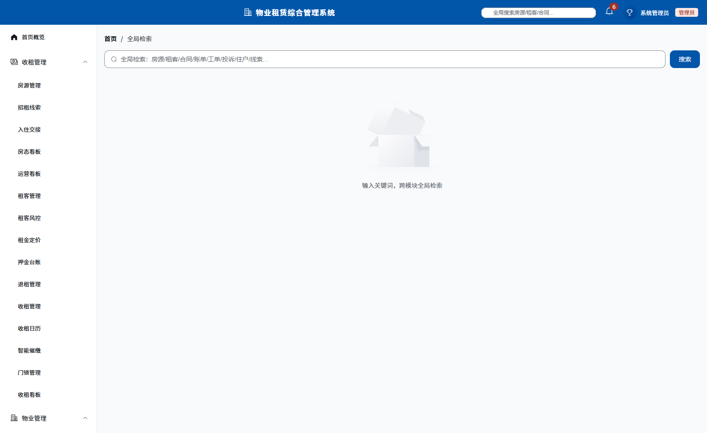

### 4.2 审批中心

汇总与当前登录者相关的审批事项，分两个页签：

- **待我审批**：需要本人处理的单据，可直接同意或驳回并填写审批意见。
- **我发起的**：本人提交的审批单及其当前进度。

也可在此直接发起新的审批申请。

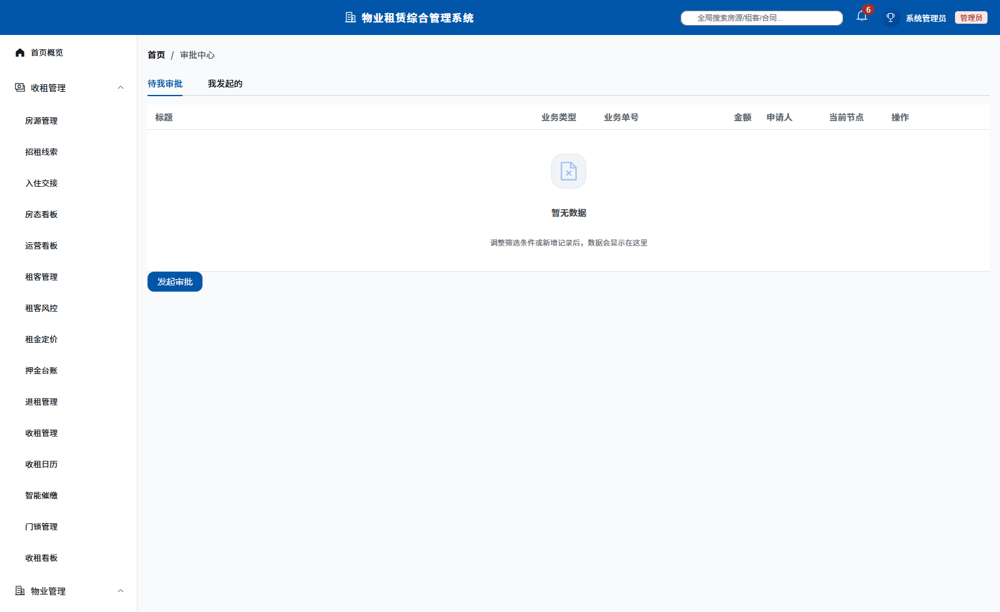

---

## 5. 首页概览

登录后默认进入首页概览，用于快速判断「今天该处理什么」。

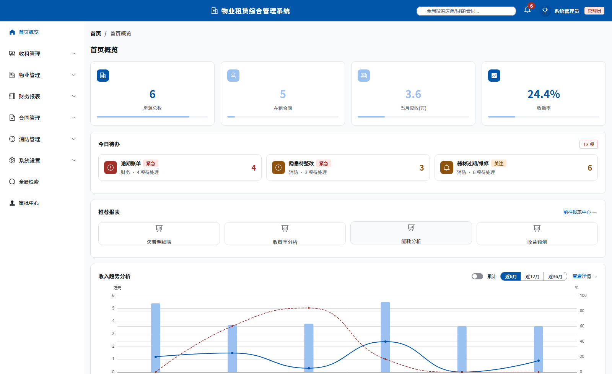

| 区块 | 内容 |
|------|------|
| KPI 卡片 | 房源总数、在租合同、当月应收（万元）、收缴率 |
| 今日待办 | 汇总 9 类待办（逾期账单、待整改隐患、器材过期、待审批合同等），按紧急程度排序，仅显示当前角色有权处理的条目 |
| 推荐报表 | 欠费明细表、收缴率分析、能耗分析、收益预测的一键入口 |
| 收入趋势分析 | 近 6 / 12 / 36 月应收与实收对比，可切换「累计」模式 |
| 预警区 | 逾期账单金额与笔数、未来到期合同列表 |
| 多模块看板 | 房态、物业运营、消防三个页签，按需加载 |
| 系统信息 | 当前版本号、后端已运行时长 |

**收缴率口径**：已缴金额 ÷ 应收金额（金额口径，不是账单份数比），与收租看板、报表中心保持一致。

页面每 60 秒自动刷新一次，同时监听实时事件；刷新过程不会打断正在进行的操作。

---

## 6. 收租管理

### 6.1 房源管理

维护全部租赁标的的基础档案。

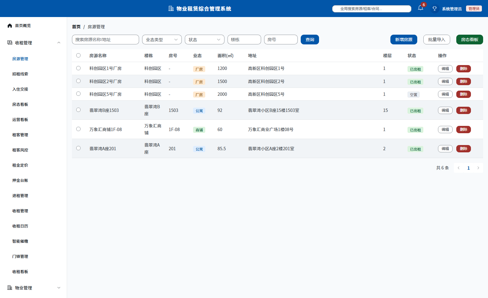

- 房源类型：公寓、厂房、商铺；可另填子类型与业主。
- 房源状态共 9 种：空置、已锁定、已预订、已出租、退租中、待保洁、待验收、维修中、已冻结。
- 支持按名称、类型、状态、楼栋筛选；点击行进入房源详情，可查看关联合同、租客与状态变更历史。

**批量导入**：进入「房源管理 → 批量导入」，先点击「下载模板」，按模板填写后上传。

| 要求 | 说明 |
|------|------|
| 文件格式 | 仅支持 .xlsx（老版 .xls 请在 Excel/WPS 中先另存为 .xlsx） |
| 文件大小 | 不超过 10 MB |
| 表头位置 | 第一行为表头 |
| 可识别列 | 名称、类型、面积、地址、楼层、单元、楼栋、房号、楼栋排序、楼层排序、子类型、业主 |

上传后会先进入预览表格，确认无误再点击「确认导入」，避免脏数据直接落库。

### 6.2 房态看板

以楼栋、楼层为维度可视化展示全部房间。

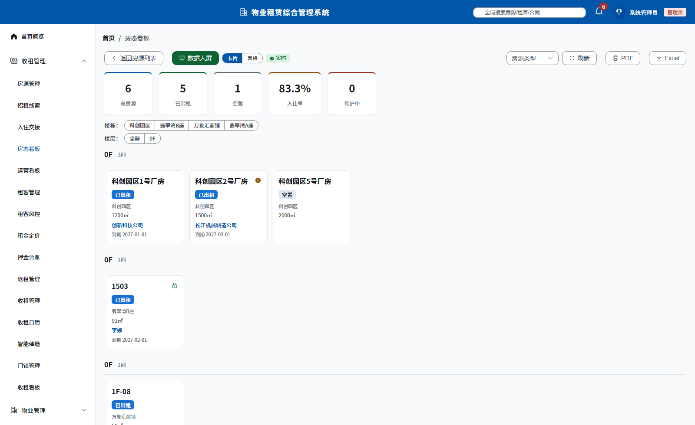

- 9 种房态用不同颜色区分，卡片上直接显示租客姓名、到期日与门锁图标。
- 顶部可按楼栋、楼层筛选；筛选在本地完成，切换无延迟。
- 点击房间卡片打开快捷操作抽屉，可查看该房间的状态变更时间线并直接变更状态。
- 勾选多个房间后可执行「批量变更状态」。
- 任何人变更房态，其他已打开该页面的电脑会实时同步。

**房态流转规则**：系统按状态机校验，非法流转会被拒绝并提示。例如「已出租」只能转为「退租中」或「已冻结」，不能直接转回「空置」；正确路径是「已出租 → 退租中 → 待保洁 → 待验收 → 空置」。

**批量生成房间**：进入「房态看板 → 批量生成」，填写楼栋名称、起止楼层、每层房间数、命名规则与默认面积，一次性建出整栋楼的房间档案。

### 6.3 房态数据大屏

深色主题的可视化大屏，适合投放到会议室或值班室显示器。

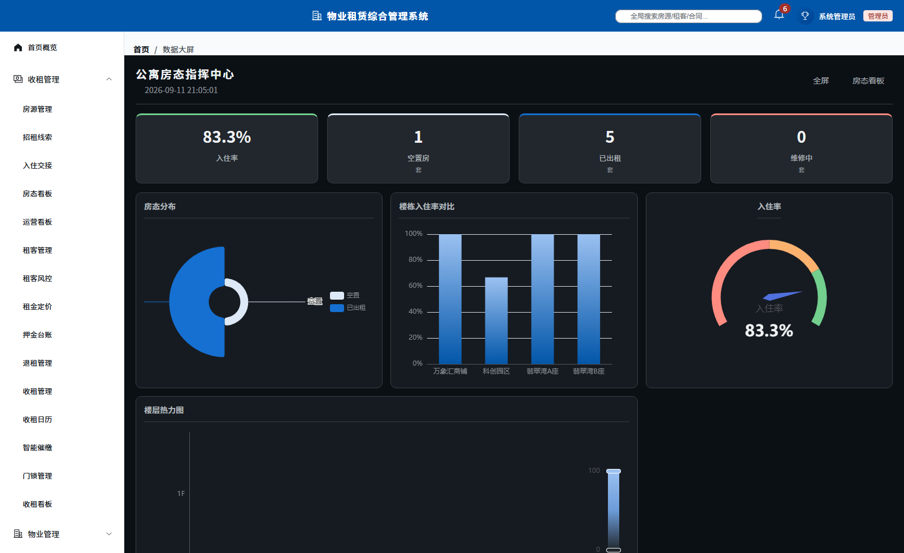

包含房态分布玫瑰图、楼栋对比柱图、入住率仪表盘、楼层热力图、趋势线、房态流转桑基图与告警跑马灯。

### 6.4 租客管理

维护租客档案，支持身份证读卡器一键录入。

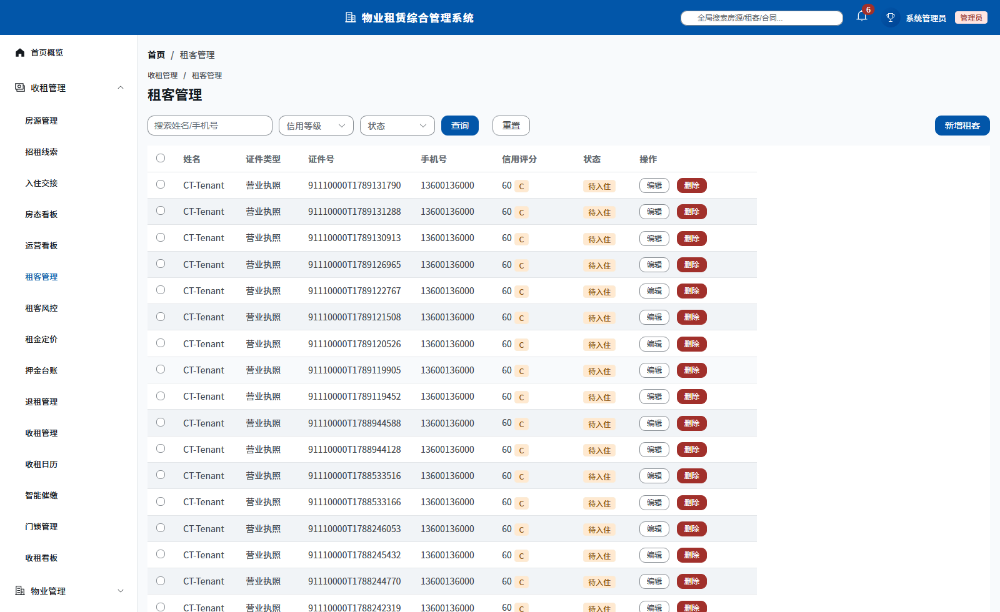

- 基础信息之外，还可保存性别、出生日期、民族、身份证地址、签发机关、有效期起止与证件照片。
- **身份证号唯一**：重复录入会被拒绝并提示已存在，避免同一人建出多份档案。
- 已关联有效合同的租客不允许删除，需先处理合同。
- 详情页汇总该租客的合同、账单、押金与缴费记录，并支持打印租客信息表。

### 6.5 招租线索

以漏斗方式跟进意向客户，顶部五张卡片分别统计新线索、已联系、已看房、已成交、已流失。

- 登记字段：客户姓名、手机、意向业态（公寓/厂房/商铺）、意向面积、预算、来源渠道、下次跟进日期。
- 来源渠道可选 58同城、贝壳、小红书、抖音、线下、转介绍、其他，便于统计获客成本。
- 行操作「跟进」记录沟通内容并推进状态；「看房」登记带看安排，看房状态含已预约、已完成、已取消、爽约。

### 6.6 入住交接

以「执行中」的合同为源头登记入住交接，交接清单固定为 6 项：水表底数、电表底数（需填写具体底数）、钥匙交接、门禁卡、家具家电完好、房屋状况。

登记押金金额后点击「交接」并确认，状态由「待交接」变为「已完成」。水电底数是日后抄表计费与退租核对的基准，务必如实填写。

### 6.7 租客风控

对全部租客给出信用评分与 A/B/C/D 四级评级，并按分数给出文字建议。

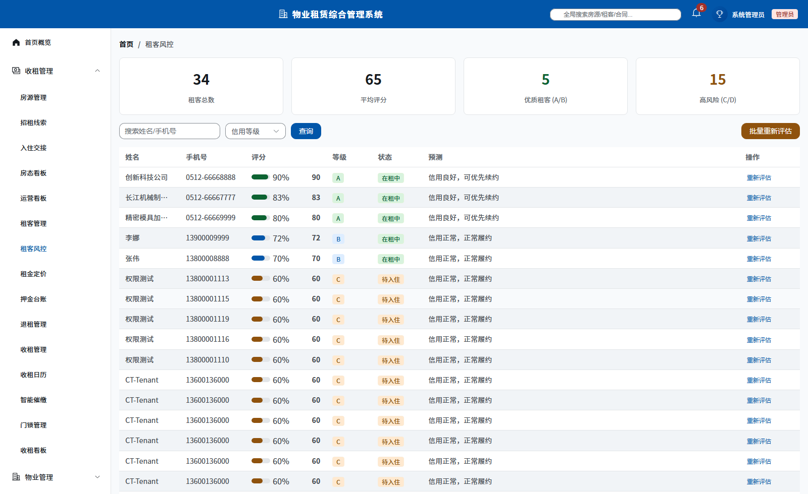

- 顶部卡片：租客总数、平均评分、优质租客（A/B）、高风险（C/D）。
- 可对单个租客「重新评估」，也可「批量重新评估」全量刷新。
- 建议在续约、调价、押金比例决策前先看此页。

### 6.8 租金定价

提供两个工具：

- **定价推荐**：输入业态、面积（㎡）与单价（元/㎡），点击「计算推荐月租」得到建议租金。
- **批量调价**：勾选执行中的合同，填写调价比例（正数为涨、负数为降），点击「执行调价」批量生效。

### 6.9 押金台账

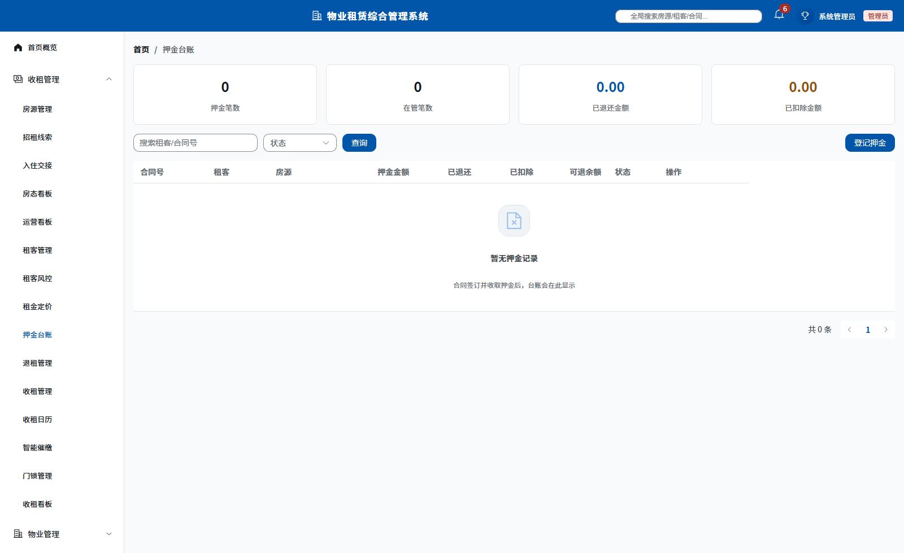

- 列出每笔押金的押金金额、已退还、已扣除与**可退余额**，状态含在管、部分退还、已退还、已抵扣。
- 操作：登记押金、退还、扣除、详情。
- 顶部卡片：押金笔数、在管笔数、已退还金额、已扣除金额。

### 6.10 退租管理

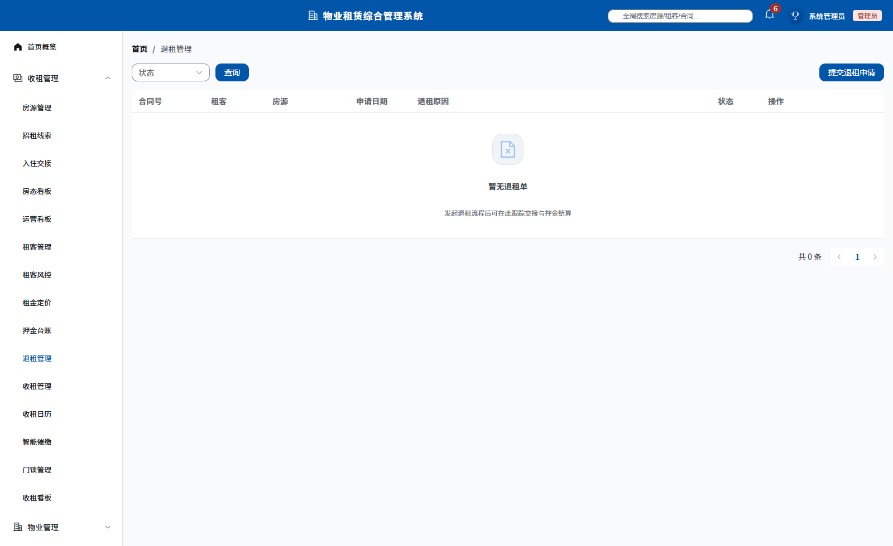

退租按「待处理 → 已受理 → 交接中 → 已完成」推进，中途可取消。

1. 提交退租申请（选择合同并填写退租原因）。
2. 「受理」确认受理，「开始交接」进入现场交接。
3. 处理弹窗中填写交接清单、费用清算（每条含项目、类型「扣除/退还」、金额）与押金退还金额。
4. 点击「完成」执行退租结算，系统会同时**终止合同、将租客置为退租、把房源转为「待保洁」**，操作前会弹出该提示确认。

### 6.11 收租管理（账单）

账单的生成、收款登记与打印。

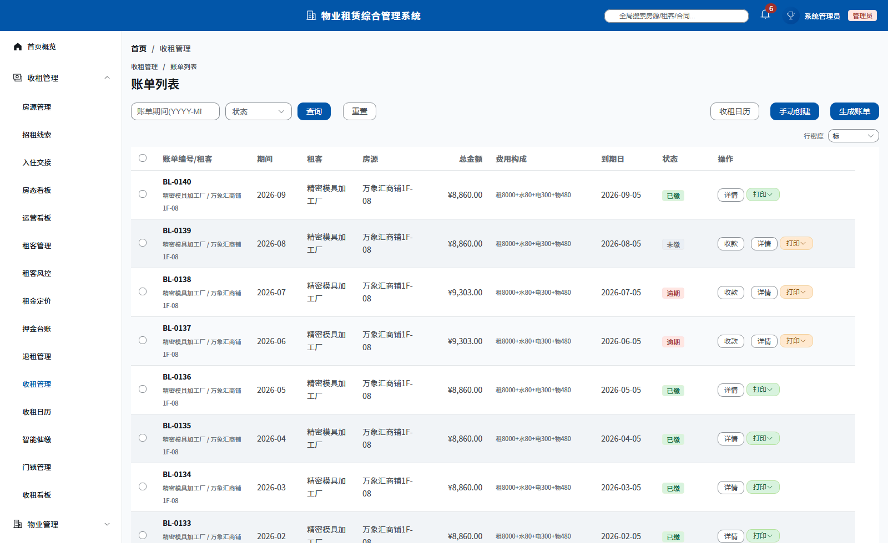

- 支持按月份、状态（未缴 / 部分缴 / 已缴 / 逾期）组合筛选，状态可多选。
- 一张账单支持多笔收款，累计收款达到应收金额后自动置为已缴。
- 逾期账单自动计算违约金，费率在合同细则中约定。
- 每行可直接打印：已缴打印收据，未缴打印账单。

### 6.12 收租日历

以月历形式展示每天到期的账单数量与金额，点击某一天查看当天明细，适合安排上门收租路线。

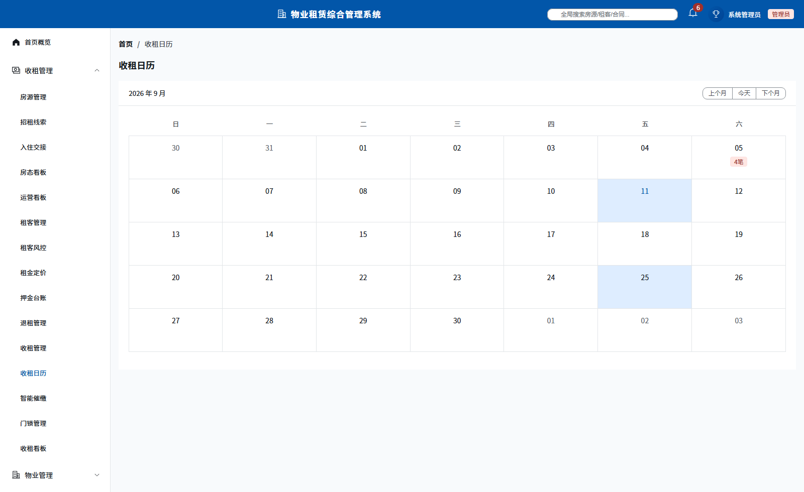

### 6.13 智能催缴

按逾期天数自动分级，避免人工判断遗漏。

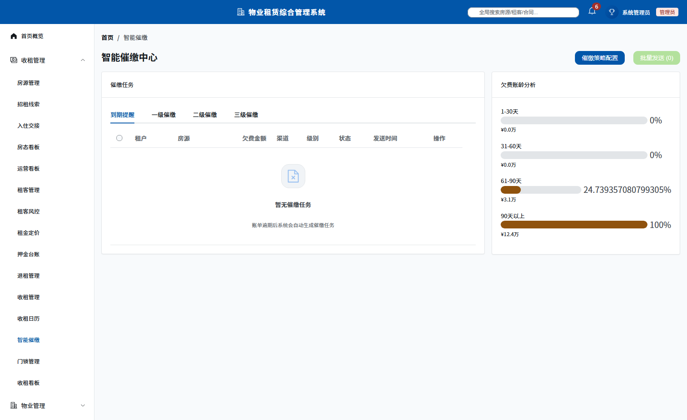

| 等级 | 触发条件 |
|------|------|
| 到期提醒 | 距到期 15 天内 |
| 一级催缴 | 逾期 30 天内 |
| 二级催缴 | 逾期 30-60 天 |
| 三级催缴 | 逾期 90 天以上 |

催缴通知可通过短信、微信模板消息或邮件发出，需先在系统参数中配置对应服务；未配置时系统仅记录催缴动作，不会中断业务。

### 6.14 门锁管理

统一管理智能门锁与传统机械锁。

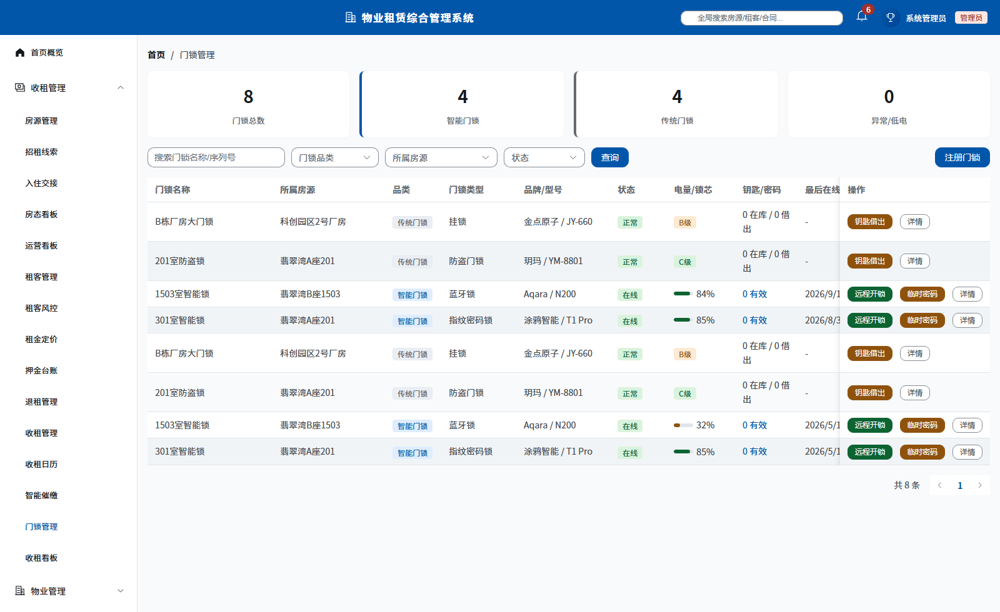

- **智能门锁**：远程开锁、下发临时密码（可设有效期与使用次数）、查看开锁日志。
- **传统门锁**：钥匙台账与借出、归还、挂失、作废流转记录。
- 两类锁共用一套操作日志，便于统一追溯。
- 过期的临时密码由定时任务每日自动清理。

### 6.15 收租看板

收租业务的可视化汇总，含收缴率趋势、欠费排名、应收实收对比等。

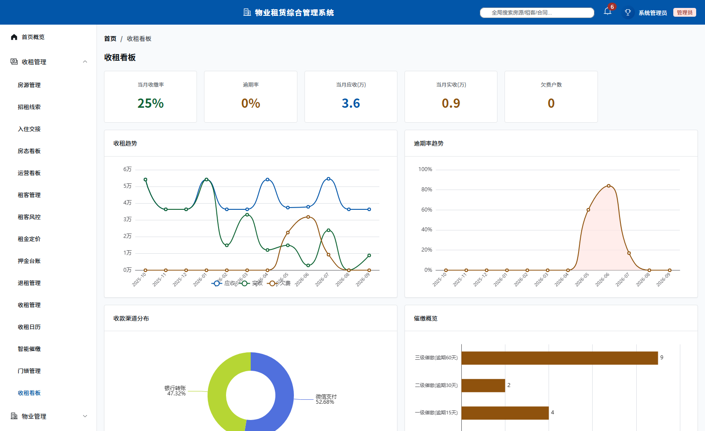
---

## 7. 物业管理

物业管理模块面向日常物业服务运营，共 20 个页面，全部列表页统一分页（每页 20 条）。

### 7.1 物业运营看板

物业条线的总入口，一屏看清当期运营状况。

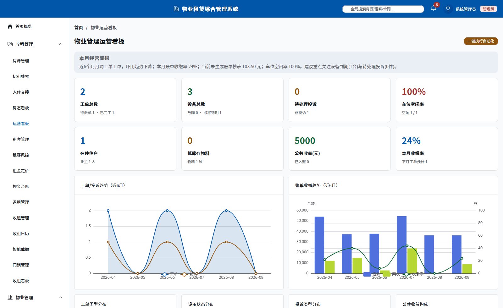

| 区块 | 指标 |
|------|------|
| 第一行卡片 | 工单总数、设备总数、待处理投诉、车位空闲率 |
| 第二行卡片 | 在住住户、低库存物料、公共收益（元）、本月收缴率 |
| 预测行 | 下月工单预测、未生成账单抄表（元）、停车累计收入（元）、本月已完工工单 |
| 图表 | 工单/投诉趋势（近 6 月）、账单收缴趋势（近 6 月）、工单类型分布、设备状态分布、投诉类型分布、公共收益构成 |

顶部「本月经营简报」条给出一句话结论与关注建议。右上角「一键执行自动化」可立即触发物业自动化任务（正常情况下每日 09:00 自动执行）。

### 7.2 报修工单

住户报修的全流程闭环。

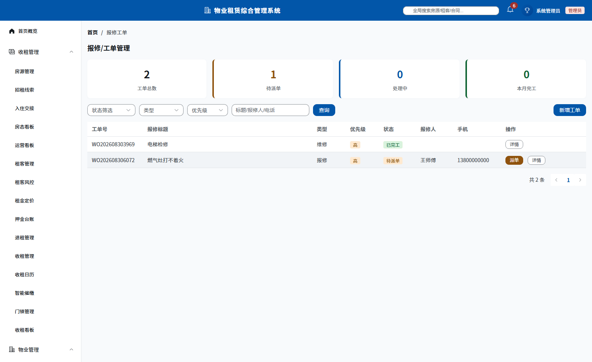

- 流转：待派单 → 已派单 → 处理中 → 待验收 → 已完工，中途可取消。
- 工单类型：报修、维修、安装、保养、其他；优先级：紧急、高、中、低。
- 操作按钮：派单（指定维修人员）、处理、验收、完工（填写处理方案与费用）、详情。
- 顶部卡片：工单总数、待派单、处理中、本月完工。

### 7.3 设施设备

设施设备台账与维保记录。

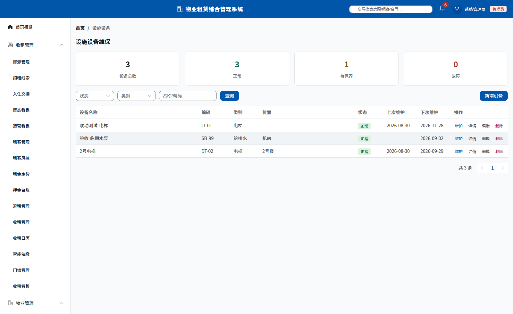

- 设备类别：电梯、水泵、配电、空调、消防、安防、给排水、其他。
- 设备状态：正常、保养中、维修中、停用、故障。
- 点击「维护」提交维护记录，需填写维护类型（巡检/保养/维修）、结果（正常/异常/已修复）、费用、执行人与下次维护日期；下次维护日期决定该设备是否进入「待保养」统计。
- 顶部卡片：设备总数、正常、待保养、故障。

### 7.4 维保计划

为设备制定周期性维保计划，周期可选月、季、半年、年。

点击「生成维保」会生成一次维保记录并把「下次执行」按周期顺延。顶部卡片：计划总数、启用、30 天内到期。

### 7.5 抄表计费

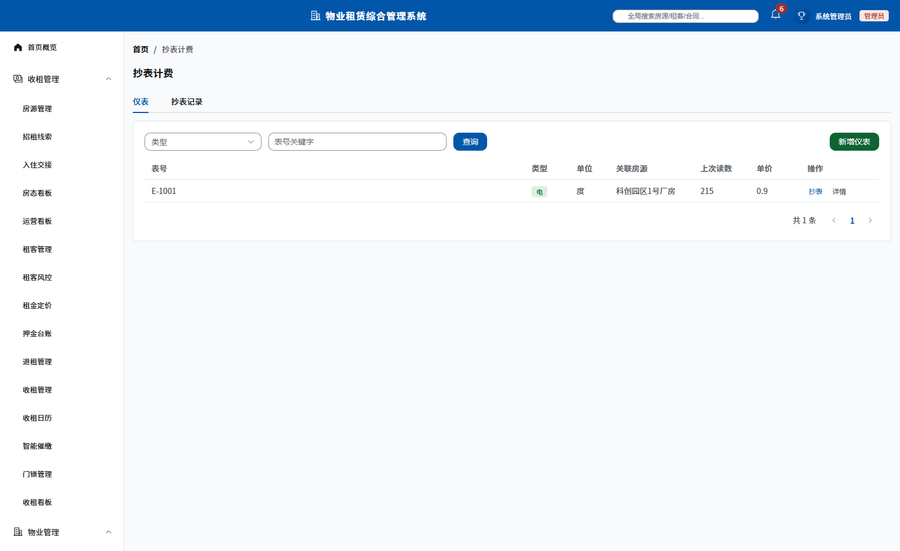

页面分两个页签：

- **仪表台账**：表号、类型（水/电/燃气）、单位、关联房源、上次读数、单价；可编辑或删除仪表、查看抄表历史。
- **抄表记录**：期间、表号、上次读数、本次读数、用量、单价、金额、抄表人、账单状态。

流程为「抄表」录入本次读数（系统自动算用量与金额）→ 「生成账单」输入账期（格式 YYYY-MM）后生成对应账单，账单状态由「未生成」变为「已生成」。

### 7.6 停车管理

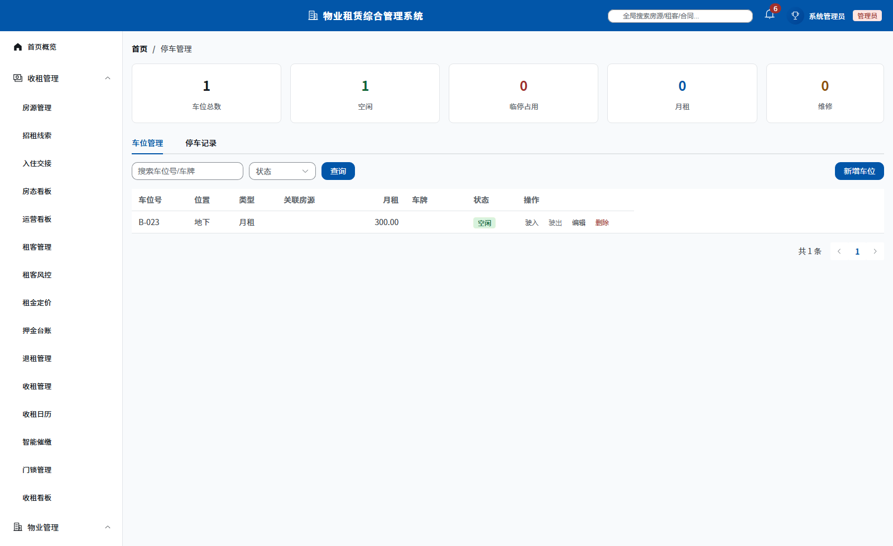

- **车位台账**：车位号、位置（地面/地下/露天）、类型（月租/临停/专用/公共）、关联房源、月租、车牌、状态（空闲/占用/月租/维修/停用）。
- **停车记录**：点击「驶入」登记车辆入场，「驶出」时系统按停放时长返回计费金额，记录状态由「进行中」变为「已支付」。
- 顶部卡片：车位总数、空闲、临停占用、月租、维修。

### 7.7 投诉建议

- 类型：投诉、建议、咨询、表扬；渠道：电话、线上、前台、其他。
- 流转：待受理 → 处理中 → 已回复 → 已解决 → 已关闭。
- 「处理」时填写处理人、回复内容、目标状态与满意度（星级评分）。
- 顶部卡片：总单数、待受理、处理中、已解决、已关闭。

### 7.8 住户档案

登记业主、住户、家属三类人员档案，含证件类型（身份证/护照/营业执照）、证件号、与业主关系、公司、入住日期，状态为在住或已搬离。顶部卡片：档案总数、业主、在住、已搬离。

### 7.9 公告发布

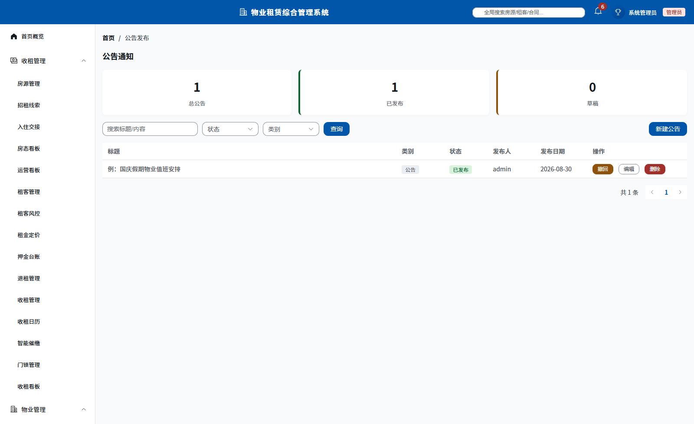

- 公告类别：公告、通知、活动、租务提示。
- 发布范围：全体租客、全体业主、指定房源、全体。
- 状态流转：草稿 →（发布）→ 已发布 →（撤回）→ 已撤回。
- 顶部卡片：总公告、已发布、草稿。

### 7.10 公共收益

登记广告位、场地出租、公共区域经营、停车收益等收入。填写金额、收款方、日期后，点击「入账」选择会计科目完成入账，状态由「应收」变为「已入账」。顶部卡片：总收益、应收、已入账。

### 7.11 外包供应商

登记维保、保洁、安保、绿化、消防、装修等类别的供应商，记录联系人、电话、合同号、合同起止、合同金额、价格与星级评分，状态含合作中、已暂停、已终止。

### 7.12 仓库物料

- 物料类别：耗材、备件、工具、劳保、其他；状态：正常、低库存、耗尽（依据数量与最低库存自动判定）。
- 点击「出入库」登记流水，类型可选入库、出库、领用、盘点，需填数量、操作人、日期与原因。
- 顶部卡片：物料总数、正常、低库存、耗尽。

### 7.13 租户服务

面向前台/客服的一站式租户服务台。

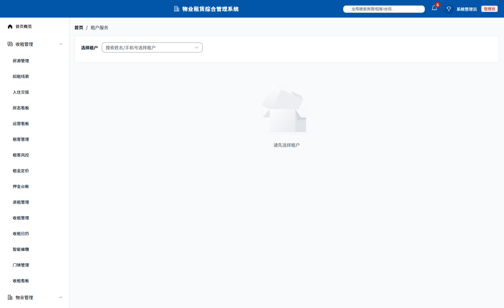

选定租户后可以：

- **发送通知**：渠道可选站内信或短信，提供「催缴提醒」「合同到期提醒」「维修完成通知」三个模板一键填充，也可自定义标题与内容。
- **查看消息记录**：渠道、标题、内容、已读状态与时间。
- **代提交报修单**：选择合同、填写标题、优先级与描述，直接生成工单。
- **查阅公告**：查看已发布公告列表。

### 7.14 装修管理

受理装修、改造、安装申请，流程为：待审批 → 审批中 → 已批准 →（施工中）→ 已完工 → 已验收；驳回则进入已驳回。可登记押金、施工方、开工与完工日期、验收人及装修内容。顶部卡片：待审批、施工中、已完工、已验收。

### 7.15 排班与质检

安排保洁、绿化、安保、消杀等任务，频次可选单次、每日、每周、每月，状态含待执行、进行中、已完成、已逾期。完成后点击「质检」填写质检结果（合格/不合格/待整改）、0-100 评分与质检员。顶部卡片：待执行、已完成、不合格。

### 7.16 巡更管理

登记巡更点、路线、日期、时间、巡更人与备注，状态为正常或异常，支持按日期范围查询。顶部卡片：总巡更记录、今日巡更、异常记录、今日异常。

### 7.17 访客管理

登记访客姓名、电话、身份证号、被访人、事由、车牌与到访时间；访客离开时点击「离开」并确认，状态由「在访」变为「已离开」。顶部卡片：访客总数、在访、当日访客。

### 7.18 特种设备

管理电梯、锅炉、压力容器、起重机械等特种设备的检验证书，记录证书号、上次检验、下次检验、检验机构，状态含合格、不合格、待检、过期。**已过期与 30 天内到期的行会高亮显示**，避免漏检。顶部卡片：设备总数、合格、待检、过期、即将到期（30 天）。

### 7.19 项目管理

维护项目（产业园、写字楼、住宅、商业综合体、厂房、公寓）档案，展示每个项目的房源数、已出租数与入住率，状态含运营中、筹备中、已停用。顶部卡片：项目总数、运营中、房源总数、平均入住率。

### 7.20 经营简报与月度简报

- **经营简报**：汇总本期 KPI（工单总数、设备总数、待处理投诉、车位空闲率、在住住户、公共收益、本月收缴率）、近 6 个月趋势表（月份、工单数、投诉数、应收、实收、收缴率）、结构占比与「预测与关注」段落，可「导出 / 打印 PDF」。
- **月度简报**：系统每月 1 日上午自动生成并归档当月简报 PDF（文字版可搜索），此页可查看归档列表并下载，也可点击「立即生成本月简报」手动补生成。

---

## 8. 合同管理

### 8.1 合同台账

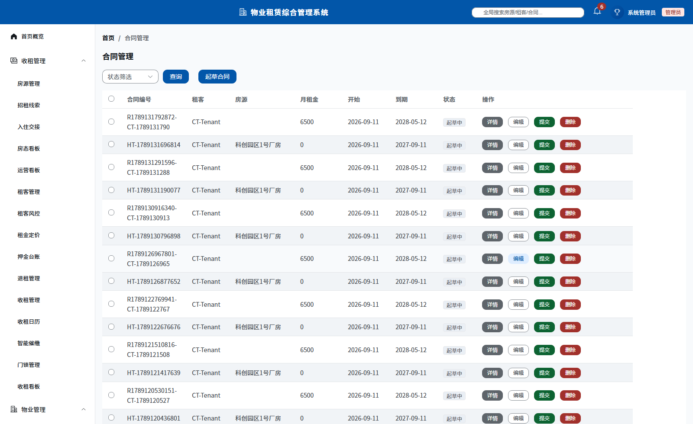

集中管理全部合同，支持按状态多选筛选、按到期日期区间筛选，并可勾选多份合同批量打印汇总表。

### 8.2 合同起草

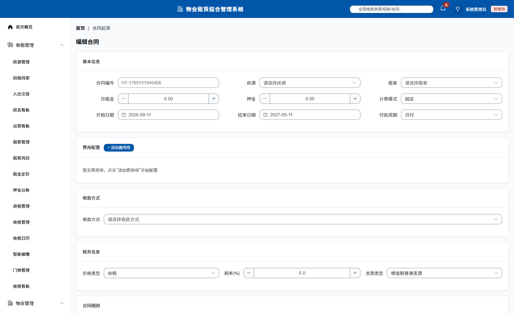

起草页按分区填写：

| 分区 | 内容 |
|------|------|
| 基本信息 | 合同编号、租客、房源、起止日期、月租金、押金 |
| 费用配置 | 费用项列表（名称、金额、单位），如物业费、水电费 |
| 收款信息 | 收款方式、开户行、账号、户名 |
| 税务信息 | 计税方式、税率、发票类型 |
| 合同细则 | 违约金费率、押金条款、维修责任方、解约通知期、续约通知期、是否允许转租 |
| 消防安全约定 | 消防责任方、检查频率、配备器材、禁止事项、违规处罚，条款与限制项支持动态增删 |
| 合同条款 | 逐条录入标题与正文，可从模板一键载入 |
| 附件 | 新建时先自动保存为草稿，随后即可上传 PDF / Word / 图片 / Excel 附件 |

选择房源后系统会按「默认模板 → 该业态常用模板 → 同类型模板」的优先级自动匹配条款模板。若该租客有通过条款导入暂存的待处理条款，也会自动带入。

### 8.3 条款批量导入

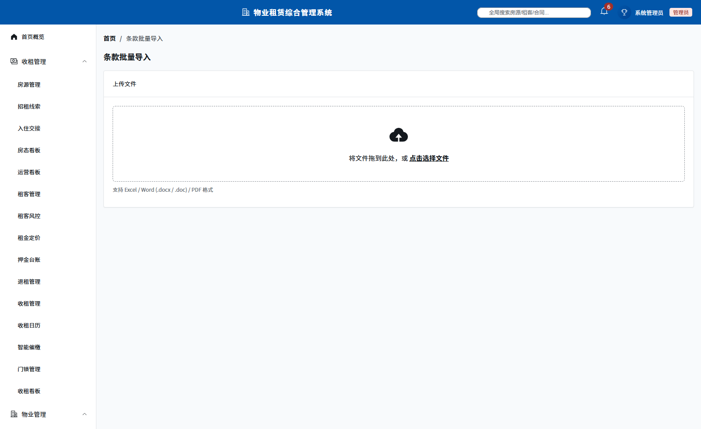

支持两种来源：

- **Excel 模式**：上传含「租客姓名 / 条款标题 / 条款内容」的 .xlsx 表格，系统按姓名匹配租客并追加到其有效合同。
- **Word / PDF 模式**：上传 .docx、.doc 或 .pdf，系统自动提取正文文本，再由「智能拆分」按「第X条 / 中文数字编号 / 阿拉伯数字编号 / 空行段落」四级规则切成条款，人工确认后选择目标租客导入。

导入的条款同时会写入该租客的「待处理条款」暂存区，**即使租客当前还没有合同**，将来新建合同时也会自动带出。导入还会按业态自动同步到「常用条款模板-公寓 / 厂房 / 商铺」，在模板列表中带「自动」标签。

上传限制：单个文件不超过 20 MB；表格仅支持 .xlsx（老版 .xls 请先另存为 .xlsx）；扫描件 PDF 因无文字层无法提取，需改用可复制文字的 PDF。

### 8.4 合同审批

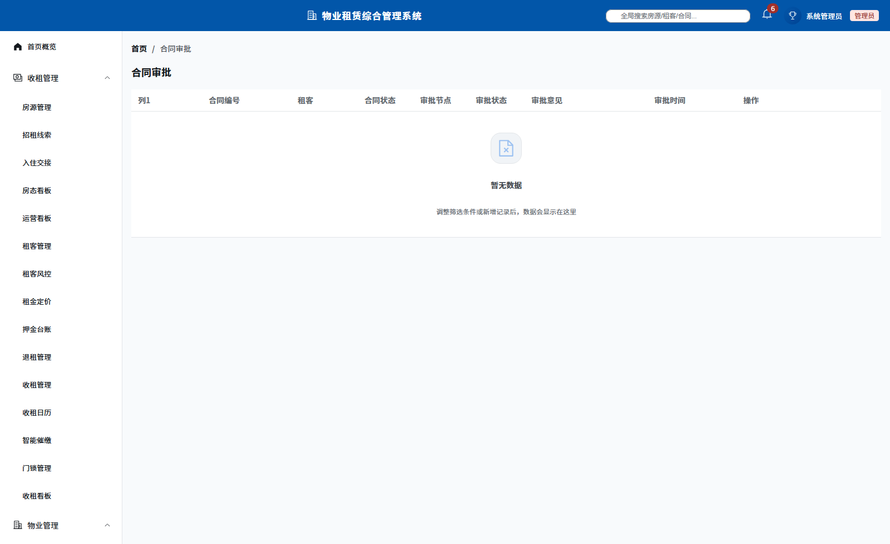

审批列表支持展开行直接查看合同详情，包括基本信息、全部条款与消防安全约定，无需跳转即可判断是否通过。默认审批流为「合同主管 → 总经理」，可在「系统设置 → 审批流程」中调整。

### 8.5 合同看板

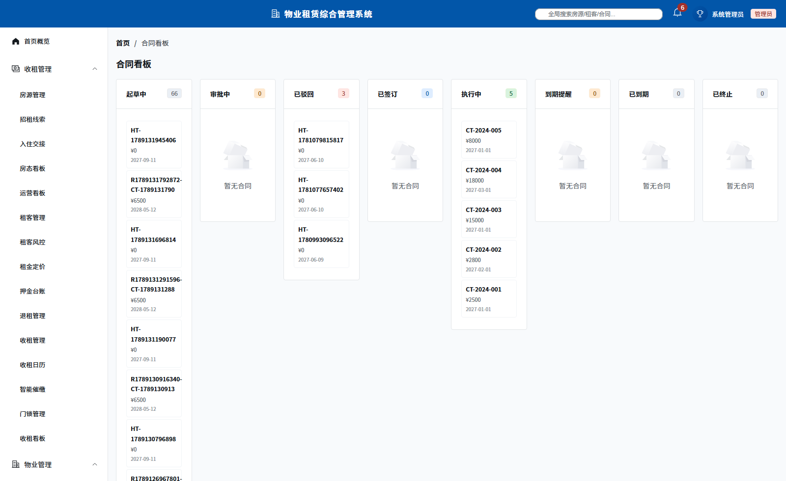

合同状态分布、到期预警与续约提醒的可视化汇总。

### 8.6 到期与续约

- **到期管理**：按时间区间列出即将到期的合同，支持导出。
- **续约管理**：对到期合同发起续约，自动复制原合同条款，仅需填写新的到期日与租金。

### 8.7 模板与合规

- **模板管理**：维护合同模板与预置条款，可设为默认模板；起草时自动匹配。
- **合规管理**：对现有合同做合规性体检，检出缺失必要条款、租期异常、金额异常等问题并给出整改提示。
---

## 9. 消防管理

### 9.1 消防看板

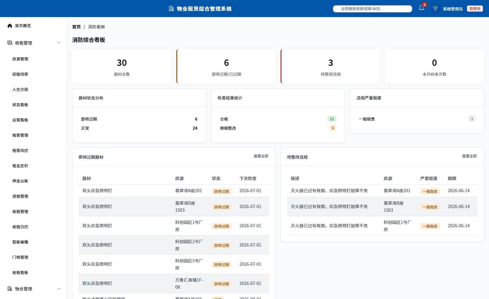

- KPI 卡片：器材总数、即将过期 / 已过期数量、待整改违规数、本月检查次数。
- 分布图：器材状态分布、检查结果统计、违规严重程度分布。
- 列表区：30 天内即将过期器材、待整改违规。
- 快捷入口直达各子功能。

### 9.2 检查记录

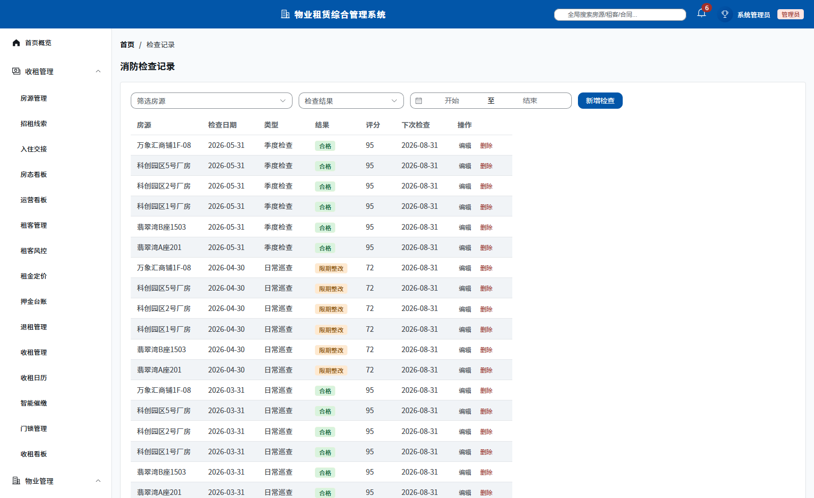

- 6 项检查维度：灭火器、烟感报警器、应急照明、疏散通道、电气线路、易燃易爆管理，逐项勾选。
- 检查结果：合格 / 不合格 / 限期整改；综合评分 0-100。
- 支持上传现场照片附件（中文文件名可正常保存）。
- 点击行进入检查详情，可查看由本次检查产生的违规记录。

### 9.3 器材台账

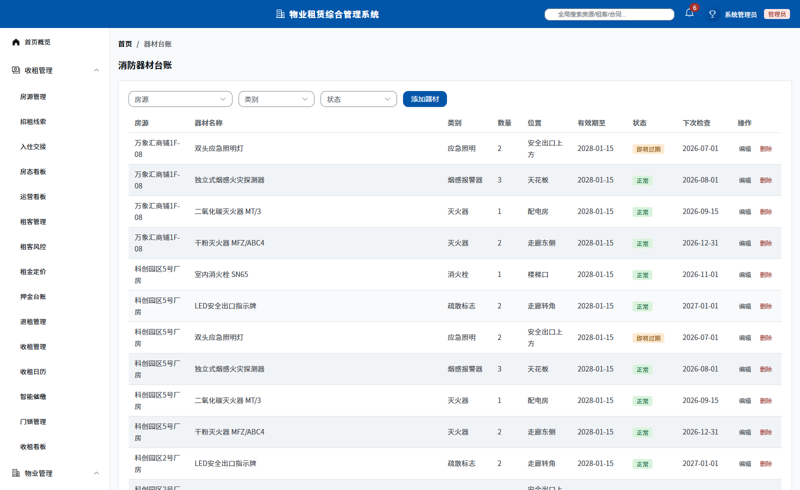

- 器材类别：灭火器、消火栓、烟感报警器、应急照明、疏散标志、防火门、自动喷淋等。
- 状态：正常、即将过期、已过期、待维修、已报废。
- **已过期行红色高亮、即将过期行黄色高亮**，30 天内到期即计入即将过期。
- 记录有效期、上次检查日期与下次检查日期。

### 9.4 违规记录

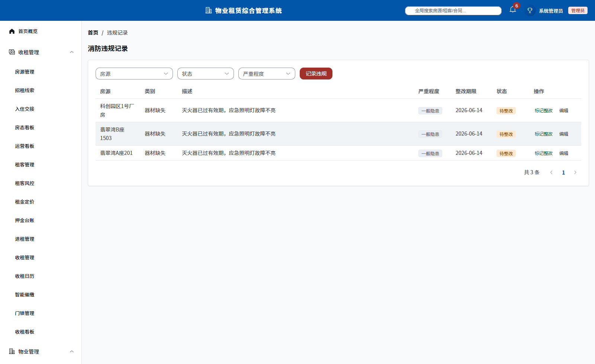

- 违规类别：器材缺失、通道堵塞、电气隐患、易燃易爆、擅自改造等。
- 严重程度：一般隐患、重大隐患、紧急。
- 整改流程：待整改 → 整改中 → 已整改；超过整改期限未完成的显示为逾期未改并红色标记。
- 可登记罚款金额。

### 9.5 演练记录

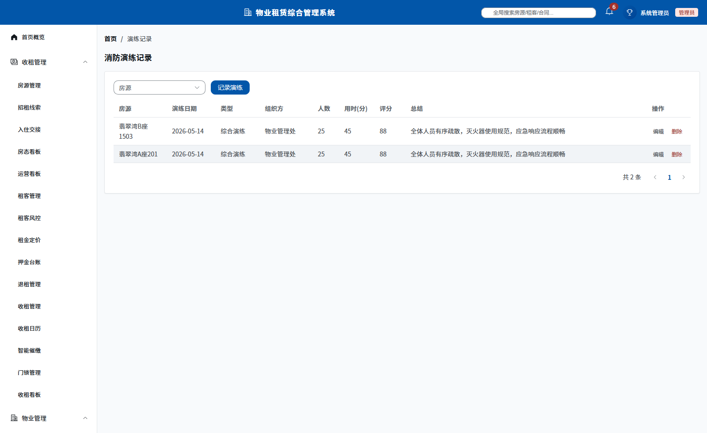

登记疏散演练、灭火演练、综合演练、桌面推演四类演练，记录参与人数、用时、评分，并总结发现问题与改进措施。

---

## 10. 财务报表

### 10.1 账套与科目

- **账套管理**：支持多账套独立核算，修改账套需二次确认。
- **科目管理**：系统初始化时自动建立 26 个标准会计科目，可按编码或名称检索，也可自行增补。

### 10.2 凭证管理

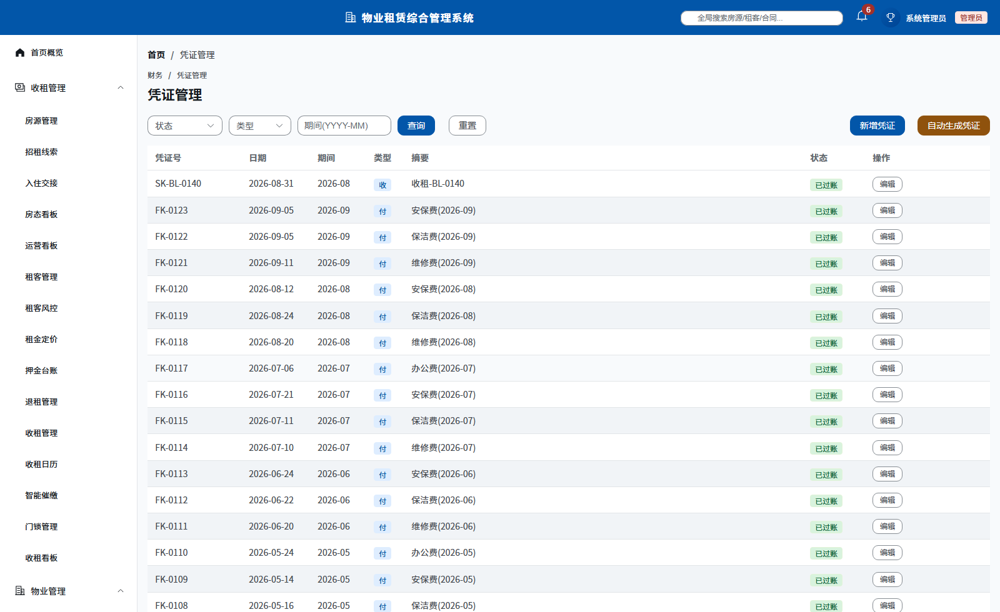

- 录入时自动校验借贷平衡，不平衡不允许保存。
- 凭证状态机：草稿 → 待复核 → 待审核 → 已过账 → 已作废。**已过账的凭证只能作废，不能回退到之前的状态**，非法流转会被拒绝。
- 作废凭证需要二次确认密码。
- 收款、退款等业务会自动生成凭证；自动生成失败只记录告警，不会影响收款本身。

### 10.3 费用核算与预算

- **费用核算**：登记物业日常费用，必须指定所属账套。金额达到大额阈值（默认 5000 元）的费用会自动进入审批流（财务主管 → 总经理）。
- **预算管理**：预算状态为编制中、待审核、已批准。**已批准的预算不允许再修改金额**，需要变更时应走新的编制流程。执行进度按实际金额与预算金额对比展示。

### 10.4 发票管理

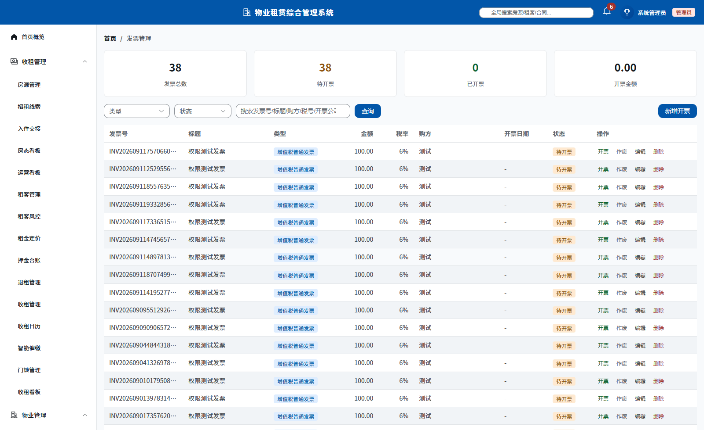

发票状态机严格受控：

| 操作 | 允许的前置状态 |
|------|------|
| 开票 | 仅「待开票」 |
| 作废 | 非「已作废」且非「已红冲」 |
| 红冲 | 仅「已开票」 |

作废、红冲、删除均需二次确认密码。发票号冲突时系统自动重试生成，最多 3 次。

### 10.5 固定资产

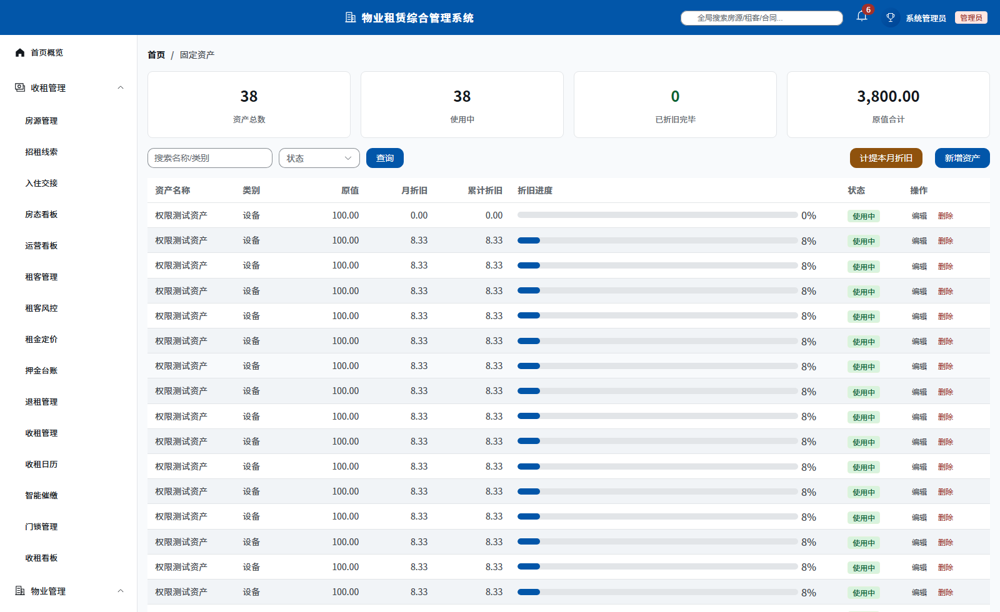

- 登记资产原值、残值、使用年限与折旧方法。
- 每月 1 日凌晨自动计提折旧；也可手动触发（需二次确认）。
- **同一期间不会重复计提**：系统按「已折旧期间」水位线跳过本期已处理的资产，累计折旧另有「原值 − 残值」封顶，不会折过头。

### 10.6 银行对账与成本分摊

- **银行对账**：上传银行流水（支持 .xlsx 与 .csv，单文件不超过 5 MB），系统按金额、日期、摘要自动匹配系统内收款记录，未匹配项人工处理。
- **成本分摊**：将公共成本按面积、户数等规则分摊到各房源或账套。

### 10.7 税务管理

按计税方式与税率测算应纳税额，支持导出申报数据。计算结果有 5 分钟缓存，短时间内重复查询不会重复计算。

### 10.8 报表中心

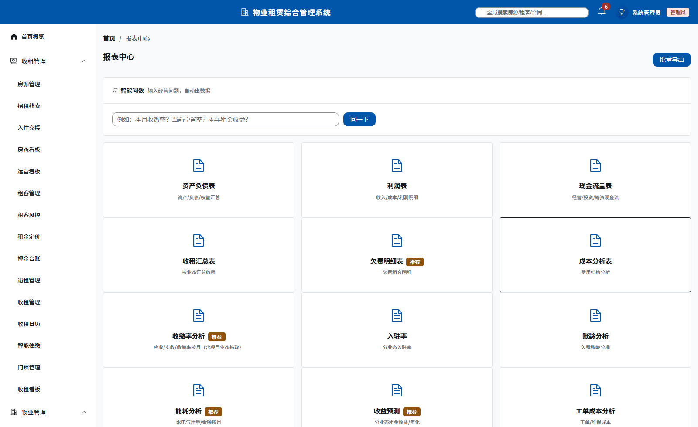

- 财务报表：资产负债表、利润表、现金流量表。
- 经营报表：入驻率报表、账龄分析、欠费明细、收缴率分析等。
- 支持导出 Excel（.xlsx）与 PDF。
- **报表可见性按角色控制**：每张报表都声明了可访问角色，未登记角色一律拒绝访问。

### 10.9 财务看板

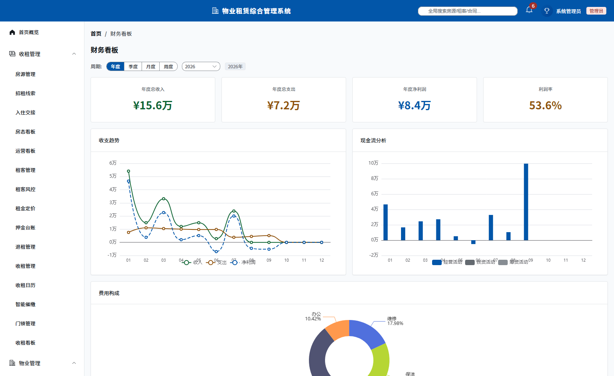

财务数据可视化大屏，含收入支出趋势、费用结构、预算执行等。

---

## 11. 系统设置

系统设置仅管理员可见。

### 11.1 用户管理

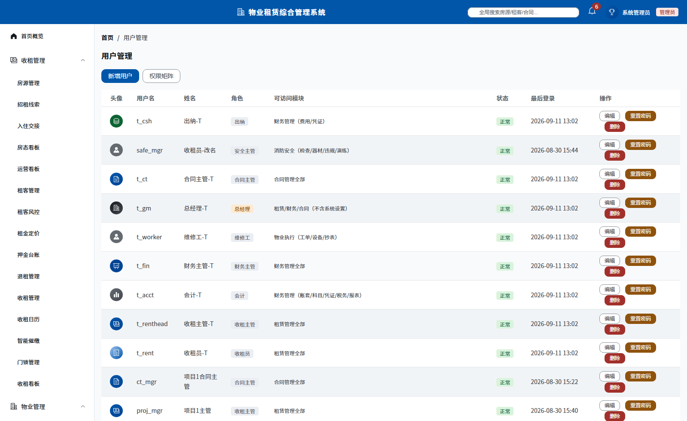

- 新建用户时必须从 12 个预定义角色中选择，非法角色会被拒绝。
- 删除用户、重置用户密码均需二次确认密码。
- **最后一名管理员受保护**：不能被删除，也不能被降级为其他角色，且管理员不能删除自己。

### 11.2 权限矩阵

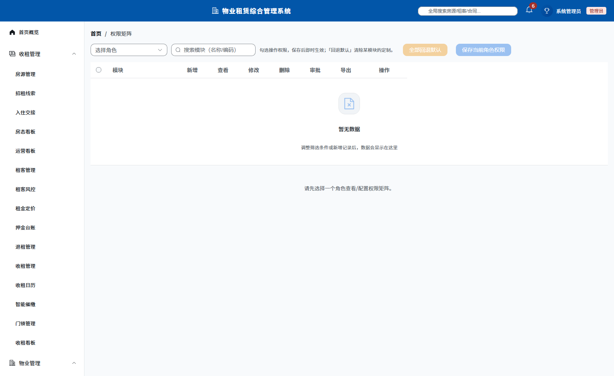

按「角色 × 模块 × 动作」调整权限：

- 支持搜索模块、批量勾选整行或整列。
- 保存与回退默认值前都需要输入管理员密码确认。
- 未定制的模块自动沿用系统默认权限，定制后立即生效。
- 所有权限变更都会写入审计日志。

### 11.3 审计日志

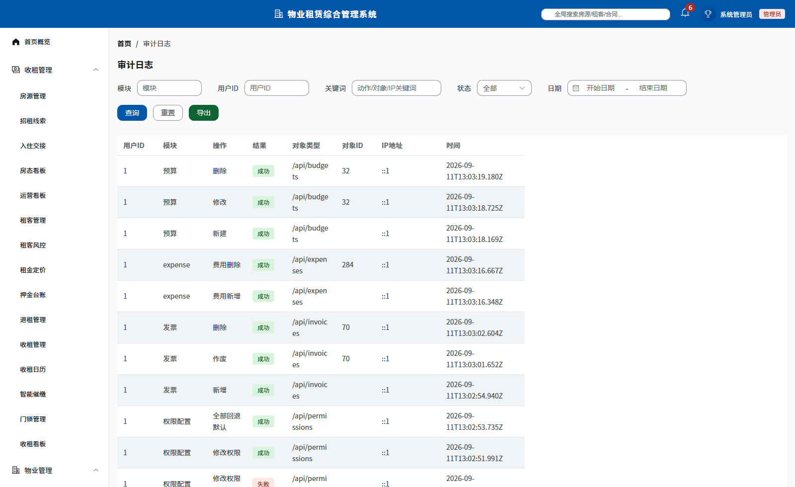

- 记录所有到达系统的操作：成功（2xx）记原动作名，失败（4xx/5xx）在动作名后追加「(失败)」标记；越权尝试额外单独记录。
- 支持按模块、操作人、动作、关键字、成功/失败状态与日期范围筛选。
- 可导出 CSV（带 BOM，Excel 打开不乱码）。
- 如需临时关闭审计，可在系统运维页切换开关（需二次确认）。

### 11.4 数据字典

维护下拉选项的取值来源（如费用类型、投诉类型等）。删除字典类型或字典项属于级联破坏性操作，均需二次确认并记入审计。

### 11.5 系统参数

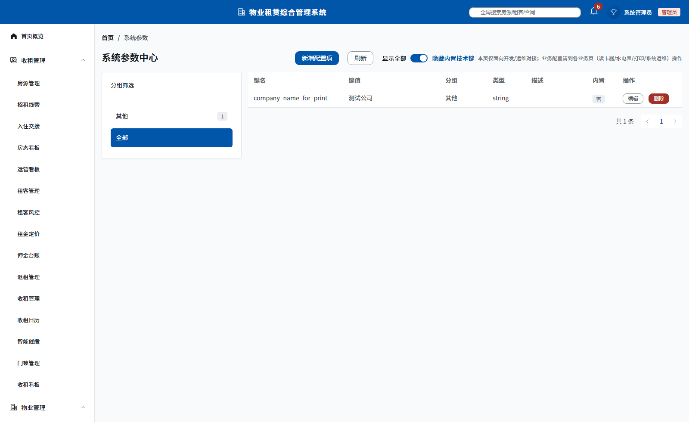

集中管理系统配置项，按分组筛选，支持新增、修改、批量保存。标记为敏感的参数（如第三方密钥）在界面上打码显示。系统内置参数不允许删除。布尔类型参数在编辑时显示为「开/关」开关。

**是否生成演示数据（demo_enabled）**：位于分组「系统」。默认开启（首次安装/空库会生成一套演示数据）；关闭后重启，整套演示数据（房源、租客、合同、账单、门锁、消防、读卡器）都不会再生成或重建。配套的内部标记 demo_seeded 记录演示数据是否已初始化，为只读信息，一般不修改。

### 11.6 打印设置

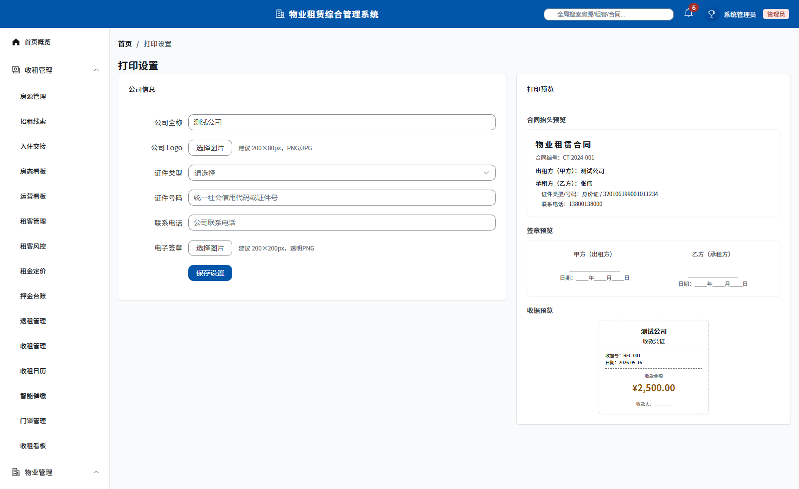

配置打印模板抬头：公司全称、公司 Logo、电子签章、证件类型、证件号码、联系电话，右侧实时预览合同抬头效果。Logo 与签章以图片形式保存在数据库中，随打印模板一起输出。

**非管理员角色也能读取这些配置**（打印合同时需要），但只有管理员能修改。

### 11.7 身份证读卡器

管理读卡器设备，支持华视、新中新、普天、精伦、中控等品牌，接口类型含 USB、串口、蓝牙、WiFi，状态含在线、离线、故障、未激活。租客录入页的「读卡」按钮会自动选择一台在线设备。读卡结果会做身份证校验位验证与重复检测，并写入读卡审计日志（身份证号脱敏保存）。

### 11.8 审批流程

配置各业务类型的审批链路。系统默认提供：合同（合同主管 → 总经理）、预算与费用（财务主管 → 总经理）。未配置流程的业务类型会直接跳过审批，不会卡单。

### 11.9 系统运维

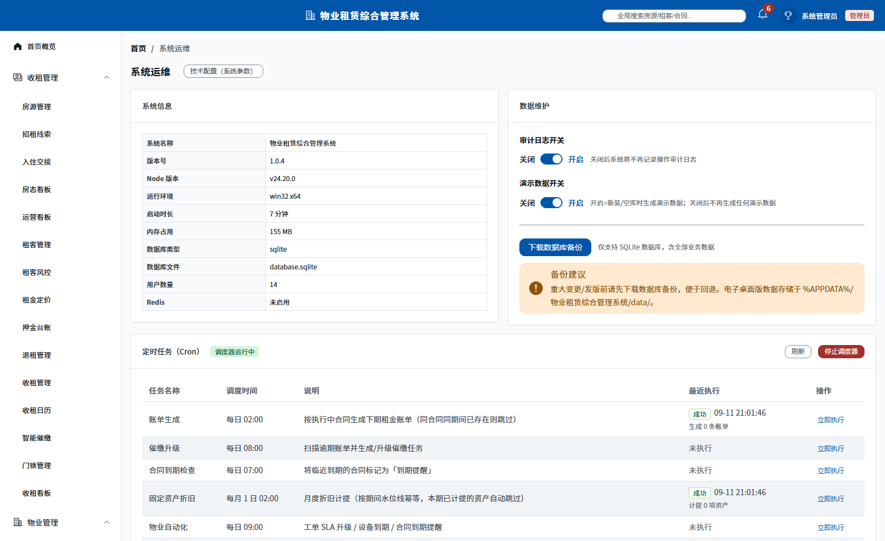

| 功能 | 说明 |
|------|------|
| 系统信息 | 版本号、Node 版本、平台、内存占用、数据库类型、用户数、已运行时长 |
| 定时任务 | 查看调度器真实运行状态与每个任务的上次执行时间，可逐个「立即执行」，也可整体启停（需二次确认） |
| 审计开关 | 开启或关闭操作审计（需二次确认） |
| 数据备份 | 下载当前 SQLite 数据库副本（需二次确认） |

---

## 12. 打印与导出

### 12.1 五套打印模板

| 模板 | 用途 |
|------|------|
| 合同 | 正式法律格式，含双方当事人对照表、章节中文编号、消防约定区块、签章位与 Logo |
| 租客信息表 | 租客档案 + 其名下合同列表 |
| 账单 | 应收明细，含金额大写 |
| 收据 | 80mm 热敏小票格式 |
| 批量汇总表 | 勾选多份合同后一键输出汇总表 |

### 12.2 打印入口

- 合同详情页：右上角「打印」下拉，可选「直接打印」或「导出 PDF」。
- 租客详情页：右上角「打印」按钮。
- 收租列表：每行操作列，已缴打印收据、未缴打印账单。
- 合同列表：勾选多行后使用批量操作栏的批量打印。

### 12.3 PDF 质量说明

桌面版导出 PDF 使用系统内置排版引擎直接输出**文字版 PDF**：文字可选中、可搜索、体积小，页面尺寸由模板自身决定（A4 纵向 / A4 横向 / 80mm 小票自动适配）。

多行文本（条款正文、备注、违规处罚说明等）会自动按段落排版并首行缩进，不会挤成一段。

---

## 13. 自动化与通知

### 13.1 内置定时任务

系统内置 7 个定时任务，随应用启动自动挂载，可在「系统运维」页查看状态或手动触发。

| 任务 | 执行时间 | 作用 |
|------|------|------|
| 账单生成 | 每日 02:00 | 按合同周期生成应收账单，同合同同期间已存在则跳过 |
| 催缴升级 | 每日 08:00 | 按逾期天数重算催缴等级 |
| 合同到期检查 | 每日 07:00 | 更新到期与预到期合同状态 |
| 固定资产折旧 | 每月 1 日 02:00 | 计提当月折旧，同期间不重复计提 |
| 物业自动化 | 每日 09:00 | 生成物业相关待办与站内提醒 |
| 月度经营简报 | 每月 1 日 09:30 | 生成并归档上月经营简报 PDF |
| 门锁密码清理 | 每日 08:30 | 清理过期的临时门锁密码 |

手动触发与定时触发执行的是同一套逻辑，结果一致，并会写入审计日志。

### 13.2 通知渠道

| 渠道 | 用途 |
|------|------|
| 站内信 | 系统内消息中心，顶部铃铛显示未读数 |
| 短信 | 催缴、到期提醒等（支持阿里云、腾讯云） |
| 邮件 | 报表与通知发送 |
| 微信 | 公众号模板消息 |

短信、邮件、微信需要在系统参数中填入对应账号密钥后才会真正发送；**未配置时系统自动降级为写日志**，不会报错也不会中断催缴等业务流程。

### 13.3 实时推送

房态变更、批量房态变更、合同创建/删除/续约/状态变更、身份证读卡成功或失败等事件会实时推送到所有已打开的客户端，相关页面自动刷新。连接断开后 3 秒自动重连。

---

## 14. 数据维护与备份

### 14.1 日常备份（推荐）

进入「系统设置 → 系统运维 → 数据备份」，输入密码确认后下载数据库副本，妥善保存到移动硬盘或网络盘。建议每周至少备份一次，重要操作（批量导入、批量调价、批量删除）之前额外备份一次。

### 14.2 手工备份

关闭应用后，直接复制以下整个目录即可完成完整备份（含附件）：

`%APPDATA%\property-rental-system\`

恢复时把该目录复制回原位置再启动应用。**复制数据库文件时必须先关闭应用**，否则可能拷到不完整的状态。

### 14.3 升级与数据兼容

新版本启动时会自动检测并补齐数据库中缺失的字段，无需人工干预，历史数据不会丢失。因此升级前的备份主要用于防范意外，而不是升级必需步骤。

### 14.4 切换到 MySQL

如需多机共用一套数据，可在配置文件中把数据库方言改为 MySQL 并填写连接信息，重启后系统会在 MySQL 中自动建表。此场景需由 IT 人员操作。

---

## 15. 常见问题

**Q：忘记管理员密码怎么办？**
A：若还有其他管理员账号，请用该账号在「用户管理」中重置密码。若所有管理员密码都已丢失，只能删除 `%APPDATA%\property-rental-system\data\database.sqlite` 后重启应用，系统会重建数据库并恢复默认账户 admin/admin123 —— **此操作会清空全部业务数据，请务必先备份该文件**。

**Q：安装时提示「Windows 已保护你的电脑 / 未知发布者」？**
A：安装包未附加代码签名证书，属正常现象。点击「更多信息」→「仍要运行」即可。如需彻底消除该提示，需要为安装包购买并配置代码签名证书。

**Q：启动后提示「后端异常」或登录按钮点不动？**
A：首次启动需要初始化数据库和演示数据，等待 10-30 秒即可。若长时间不恢复，请检查 3001 端口是否被其他软件占用，或查看 `%APPDATA%\property-rental-system\logs\` 下的日志。

**Q：上传 Excel 提示「仅支持 .xlsx」？**
A：系统统一使用 .xlsx 格式，不再支持老版 .xls 二进制格式。请在 Excel 或 WPS 中打开原文件，选择「另存为」→ 文件类型选「Excel 工作簿 (.xlsx)」后重新上传。

**Q：房源导入失败或数据不对？**
A：请先在导入页下载模板，保证第一行是表头且列名与模板一致（名称、类型、面积、地址、楼层、单元、楼栋、房号等）。上传后先看预览表格再确认导入。单个文件不超过 10 MB。

**Q：为什么房态不能从「已出租」直接改成「空置」？**
A：房态受状态机约束，必须按「已出租 → 退租中 → 待保洁 → 待验收 → 空置」流转，以保证退租、保洁、验收环节都有记录可查。

**Q：删除租客时提示不允许？**
A：该租客名下还有合同。请先处理（终止或删除）其合同，再删除租客。

**Q：条款批量导入找不到租客？**
A：Excel 中的「租客姓名」列必须与系统中已录入的租客姓名完全一致（含空格与全半角）。Word / PDF 模式则需要手动选择目标租客。

**Q：上传的 PDF 提取不出条款文字？**
A：扫描件 PDF 本质是图片，没有文字层，系统无法提取。请使用可复制文字的电子版 PDF，或改用 Word 文档。

**Q：打印合同出现乱码或排版错位？**
A：请确认系统已安装「宋体」和「微软雅黑」字体。桌面版导出的是文字版 PDF，若在第三方阅读器中显示异常，可先用系统自带的 PDF 阅读器或浏览器打开确认。

**Q：明明有权限，按钮却提示「权限不足」？**
A：权限可能被管理员在「权限矩阵」中定制过。请让管理员检查该角色在对应模块的动作勾选情况；越权尝试也会记录在审计日志中，可据此排查。

**Q：消防器材过期提醒不准确？**
A：请确认器材的「有效期至」与「下次检查日期」填写正确，系统按下次检查日期判断是否进入「即将过期」（30 天内）。

**Q：定时任务好像没跑？**
A：进入「系统设置 → 系统运维 → 定时任务」查看调度器实际运行状态与每个任务的上次执行时间，可点击「立即执行」手动补跑。注意应用必须处于运行状态，关闭应用后定时任务不会执行。

**Q：数据能多台电脑共用吗？**
A：默认的 SQLite 模式是单机本地库，不支持多机共享。多机共用需切换到 MySQL 并由 IT 人员完成部署。

---

> 本说明书随系统版本更新。如遇文档未覆盖的问题，请联系系统管理员或供应商技术支持。
